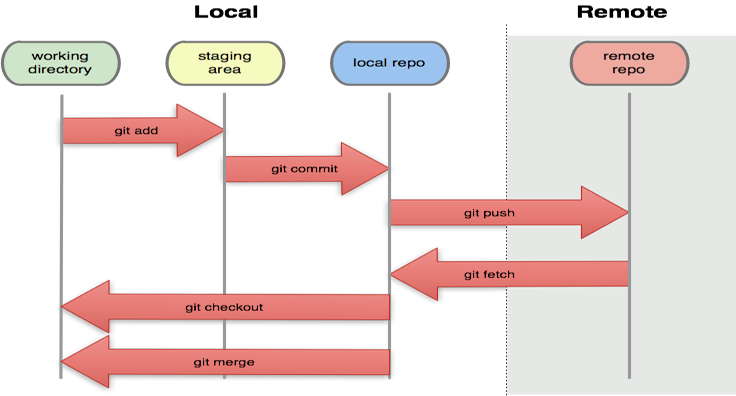

Git命令列表
==========

## 概述
> Git是一款免费、开源的分布式版本控制系统, 作者:Linux之父Torvalds 

## git的安装
> http://msysgit.github.io/  
> https://git-scm.com  
> 支持命令行和图像界面操作  

## git配置 

```bash
# 配置用户名
git config --global user.name <你的名字>

# 配置邮箱
git config --global user.email <你的邮箱>

#在git命令中开启颜色显示
git config --global color.ui true

# 命令别名
git config --global alias.co checkout
git config --global alias.ci commit
git config --global alias.st status
git config --global alias.br branch

# 提交到git是自动将换行符转换为lf(报警换行符时可以用这个配置)
git config --global core.autocrlf input

# 推送和提交时, 默认匹配本地分支
git config --global push.default matching
git config --global pull.default matching

# 查看配置的信息
git config --list

# 用户的git配置文件~/.gitconfig
```

## 新建版本库

```shell
#初始化一个本地版本库
git init [项目名称]

#克隆一个远程的版本库
git clone <远程版本库url>
```

## 查看版本库状态&差异

```shell
#查看状态
git status

#查看工作区和暂存区的不同
git diff

#查看暂存区和上次提交(本地仓库)的不同
git diff --cached

#查看工作区和上次提交(本地仓库)的不同
git diff HEAD

#查看两次提交的不同
git diff <commit1> <commit2>

#查看提交历史
git log

#查看指定文件的历史
git log -p [文件/目录]

#查看指定文件的历史(列表形式)
git blame [文件]
```

## 分支与标签

```shell
#查看所有本地分支
git branch

#查看所有远程分支
git branch -r

#查看所有本地和远程分支
git branch -av

#切换分支或者标签
git checkout <分支名称/标签名称>

#删除一个分支
git branch -d <分支名称>

#强制删除一个分支
git branch -D <分支名称>

#合并一个分支到当前分支
git merge <分支名称>

#将分之上超前的提交，变基到当前分支
git rebase <分支名称>

#查看所有本地标签
git tag

#基于当前分支新建一个标签
git tag <标签名称>

#删除一个标签
git tag -d <标签名称>
```

## 修改与提交

```shell
#添加一个文件到暂存区
git add <文件>

#添加多个文件到暂存区
git add <文件1> <文件2>

#添加所有变更(需要添加,删除,修改)的文件到暂存区
git add .

#提交暂存区的文件到本地版本库
git commit -m "提交信息"

#提交并跟踪暂存区的文件到本地版本库
git commit -ad "提交信息"

#用暂存区的文件覆盖当前工作区的文件(丢弃工作区的文件)
git checkout -- <文件>

#撤销暂存区的文件到工作区(撤销git add)
git reset HEAD <文件>
git reset --herd
```

## 远端
```shell
git fetch originname <branchName> #拉去远端上指定分支
git merge originname/<branchName> #合并远端上指定分支
git push originname <branchName> #推送到远端上指定分支
git push originname localbranch:serverbranch #推送到远端上指定分支
git checkout -b test origin/dev #基于远端dev新建test分支
git push origin :branchName #删除远端分支, 原理是提交空的分支
```

## 源
```shell
git remote add origin1 git@github.com:yanhaijing/data.js.git
git remote #显示全部源
git remote -v #显示全部源+详细信息
git remote rename origin1 origin2 #重命名
git remote rm origin1 #删除
git remote show origin1 #查看指定源的全部信息
```

## 其他
```shell
git help <command> #查看帮助的命令
```


## 实例
配置git  

```shell
git config --global user.name "<用户名>"
git config --global user.email "<邮箱>"
```

克隆代码  

```shell
git clone <git仓库地址>
```
提交代码

```shell
git add <文件名>
git commit -m "<提交说明>"
git push <源名称> <本地分支>:<远程分支>
```

拉取最新代码

```shell
git fetch <源名称> <远程分支>
git merge <源名称> <分支名称> #合并到当前分支
```

从远程拉取分支到本地创建

```shell
git checkout -b <分支名称> <源名称>/<远程分支名称>
```
切换分支
    
```shell
git checkout <分支名称>
```
    

## 良好的git协作方式
远程分支:
> master

本地分支
> a

```shell
git checkout a
#coding...
git add .
git commit -m "message"
git checkout master
git pull
git checkout a
git rebase master #如果有冲突在此时解决
git checkout master
git merge a
git push origin master
```

## 图解git工作流程

