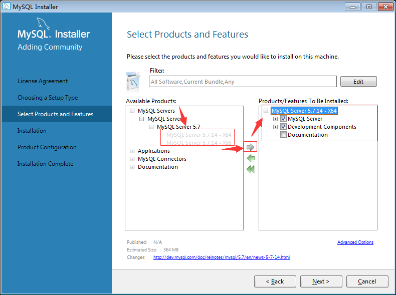
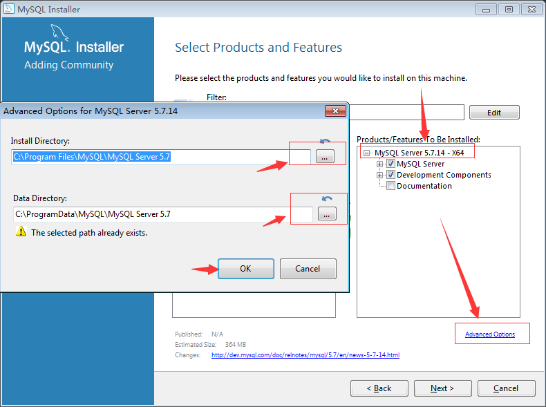
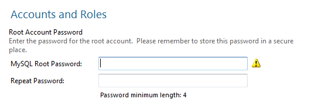
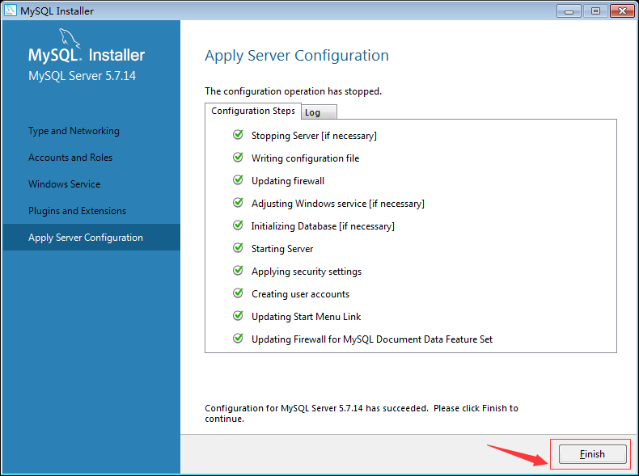

独立安装wamp环境
===============

## 概述
WAMP的从广义上来讲是Windows + Apache + MySql + PHP，是一个用来搭建动态网站的开发环境。  

可能有人会说现在在网上已经有这么多的集成环境了，你这是闲着没事干？来捣腾这个？好吧，网上确实有许多很优秀的集成环境套件，但作为一个专业的PHPer的你，是不是应该小小的深入一下呢？在这之前有两个问题。  
1. 为什么我们需要独立安装？  
2. 集成环境的缺点是什么呢？  

> 为什么我们需要独立安装？笔者觉得主要有以下几点：  

* 更加深入的理解各个程序之间的关系  
* 为以后搭建LAMP或者LNMP环境打基础  

> 集成环境的缺点是什么呢？  

搭建好的集成各个程序的版本是固定的，可能又有人说有的集成环境可以随意切换版本呀，比如`phpstudy`、`xampp`等，但是当你需要使用更多的功能的时候就会发现用不了，因为为了减少安装包的大小，但又要兼顾许多版本的程序，所以会删减一些不常用的程序。比如笔用phpstudy环境使用PHPDocumentor来生成文档时，就出现各种程序找不到，最后还是用独立安装的环境解决。  

## 基本步骤  
1. 下载各个软件  
2. 执行安装  
3. 修改配置文件，让程序能够关联起来  

## 获取软件  
这里演示是使用的以下的环境&版本  

* Windows 7_x64  
* PHP5.6.24_x64  
* httpd-2.4.23_x64  
* mysql-5.7.14_x64  


> PHP  

* 下载页面：[http://windows.php.net/download](http://windows.php.net/download)
* 下载地址1：[http://windows.php.net/downloads/releases/php-5.6.24-Win32-VC11-x64.zip](http://windows.php.net/downloads/releases/php-5.6.24-Win32-VC11-x64.zip)  
* 下载地址2：[http://pan.baidu.com/s/1qXOH1ww](http://pan.baidu.com/s/1qXOH1ww)  

> Apache  

* 下载页面：[http://www.apachehaus.com/cgi-bin/download.plx](http://www.apachehaus.com/cgi-bin/download.plx)  
* 下载地址1：[http://www.apachehaus.com/downloads/httpd-2.4.23-x64-vc14.zip](http://www.apachehaus.com/downloads/httpd-2.4.23-x64-vc14.zip)  
* 下载地址2：[http://101.44.1.12/files/31590000058B42CD/www.apachehaus.com/downloads/httpd-2.4.23-x64-vc14.zip](http://101.44.1.12/files/31590000058B42CD/www.apachehaus.com/downloads/httpd-2.4.23-x64-vc14.zip)  
* 下载地址3：[http://pan.baidu.com/s/1i43rbbJ](http://pan.baidu.com/s/1i43rbbJ)  

> MySql  

* 下载页面：[http://dev.mysql.com/downloads/mysql/](http://dev.mysql.com/downloads/mysql/)  
* 下载地址1：[http://101.44.1.3/files/412600000590C5C3/dev.mysql.com/get/Downloads/MySQLInstaller/mysql-installer-community-5.7.14.0.msi](http://101.44.1.3/files/412600000590C5C3/dev.mysql.com/get/Downloads/MySQLInstaller/mysql-installer-community-5.7.14.0.msi)  
* 下载地址2：[http://pan.baidu.com/s/1slfAxjf](http://pan.baidu.com/s/1slfAxjf)  


## 安装

> 先创建如下目录  

`D:\amp\php` #PHP的安装目录  
`D:\amp\apache` #Apache的安装目录  
`D:\amp\mysql` #MySql的安装目录  
`D:\amp\mysql\data` #MySql的数据库中的数据存放目录  
`D:\www` #程序目录  

### 安装Apache  

1. 将下载好的压缩包解压到D:\amp\apache目录中,  
2. 打开CMD 运行`D:\amp\apache\bin\httpd.exe -k install`(安装apahce服务到系统中)  

> 如果提示缺少DLL文件, 请安装VC运行库.  
> [http://pan.baidu.com/s/1kUTCspp](http://pan.baidu.com/s/1kUTCspp)  

### 安装PHP  

1. 将下载好的压缩包解压到D:\amp\php目录中即安装完成。  
  
### 安装MySql  

1. 双加mysql-installer-community-5.7.14.0.msi运行程序。  
2. 点击I accept the license terms （同意协议）,点击next。  
3. 选择Custom （自定义），点击next。  
4. 展开MySql Servers -> MySql Server -> MySql Server 5.7,选择MySql Server 5.7.14 -   X64或者X86,点击中间的向右的箭头。  

5. 选中右边的MySql Server 5.6.14 - X64，点击Advanced   Options，分别设置MySql的安装目录和MySql数据的目录，点击OK，点击next。  

6. 一路next或者execute，其中有一个设置密码的地方，如图所示  

7. 最后出现这样的界面即安装完成  

  
## 配置  

###  配置Apache，将Apache和PHP关联起来  

* 打开`D:\amp\apache\conf\httpd.conf` (Apache主配置文件)  
* 修改第38行`Define SRVROOT "/Apache24"`为 `Define SRVROOT "D:\amp\apache"`  
* 修改第246行`DocumentRoot "${SRVROOT}/htdocs"`为 `DocumentRoot "D:\www"` (设置网  
* 修改第280行`DirectoryIndex index.html`加入`index.php`
* 在文件末尾加入以下代码(将PHP作为Apahce的模块运行，添加识别php类型，设置php配置文件路径  

```apache
LoadModule php5_module "D:\amp\php\php5apache2_4.dll"
AddType application/x-httpd-php .php
PHPIniDir "D:\amp\php"
```

### 配置PHP环境（开启一些常用的扩展，设置时区等）  

* 复制`D:\amp\php\php.ini-development`为`D:\amp\php\php.ini` (PHP主配置文件)  
* 修改925行的`;date.timezone =`修改为`date.timezone = PRC`  
* 修改735行的`; extension_dir = "ext" `; 修改为`extension_dir = "D:\amp\php\ext"`  
* 找到877行，将如下行前面的分号去掉，修改好如下：  

```ini
extension=php_gd2.dll
extension=php_mbstring.dll
extension=php_mysql.dll
extension=php_mysqli.dll
extension=php_pdo_mysql.dll
```


## 启动&重启  
  
### 启动  

按键`Win+R`输入`services.msc`，找到并选中Apache2.4，点击`启动`。  

### 重启  

按键`Win+R`输入`services.msc`，找到并选中Apache2.4，点击`重启动`  

> 如果不能启动请检查80端口是否被占用（`netstat -ano`）， 2配置文件有误，运行`httpd.exe -t`可以检测配置文件语法  
  

## 注意  

修改Apache或者PHP配置文件后，需要重新启动Apache才能生效  

## 扩展配置  

#### 虚拟域名配置  

1. 打开文件`C:\Windows\System32\drivers\etc\hosts`，加入`127.0.0.1 xc.com`  
2. 将Apache配置文件`D:\amp\apache\conf\httpd.conf`的499行`# Include conf/extra/httpd-vhosts.conf`前面的`#`去掉  
3. 编辑文件httpd-vhosts.conf，加入如下代码  

```apache
#网站名称
<VirtualHost *:80>
    #网站的路径
    DocumentRoot "D:/www"

    #网站的主机名
    ServerName xc.com

    <Directory "D:/www">
         #找不到索引文件时,显示文件列表,
         #前面加有"+"号的可选项将强制覆盖当前的可选项设置，
         #而所有前面有"-"号的可选项将强制从当前可选项设置中去除。
         Options +Indexes +FollowSymLinks

         #确定允许存在于.htaccess文件中的指令类型
         AllowOverride All

         #权限的顺序
         Order allow,deny

         #权限的控制
         Allow from all
         # deny from 192.168.25.153
    </Directory>
</VirtualHost>
```

> 如果需要配置多个虚拟域名，请重复第1步和第3步。  
