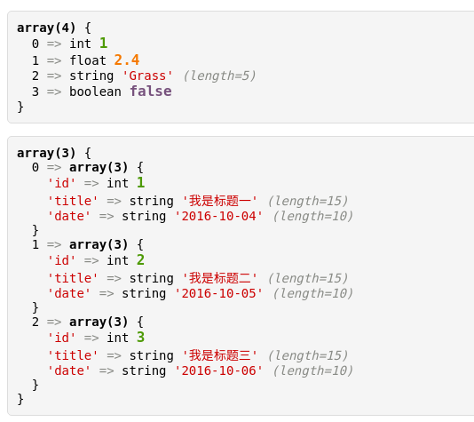

title: 美化的PHP打印函数v
========================

# 打印效果截图



# 代码
```php
<?php
/**
 * 美化的打印数据函数
 * 兼容网页，接口，命令行打印
 * 可以根据css自定义显示样式
 * 使用方法：
 * v($arr, $string);// 打印多个变量
 * v($arr, 'print_r');// 用原声函数print_r打印，通常用于接口打印
 * @date 2016-09-27
 * @author Grass <14712905@qq.com>
 */
function v(){
    $args = func_get_args();
    $print_func = array('var_dump', 'print_r', 'var_export');
    if (count($args) > 1 && in_array($args[count($args) - 1], $print_func)) {
        $api_func = $args[count($args) - 1];
        array_pop($args);
        echo '<pre>';
    } elseif (PHP_SAPI !== 'cli'){
        echo '<style>pre{border:1px solid #ddd;background-color:#f5f5f5;color:#000;font-size:14px;border-radius:5px;padding:10px;font-family:Monaco,Menlo,Consolas,monospace; } .string{color:#cc0000; } .boolean{color:#77527D;font-size:16px;font-weight:bold; } .array{font-weight:bold; } .int{color:#4E9A06;font-size:16px;font-weight:bold; } .float{color:#F57900;font-size:16px;font-weight:bold; } .null{color:red; } .object{font-weight:bold; } .index{color:#000; } .symbol{color:#888A85; } .length{font-style:italic;color:#888A85; } </style>';
    }
    foreach ($args as $v) {
        if(isset($api_func)){
            $api_func($v);
            continue;
        }elseif(PHP_SAPI == 'cli'){
            var_dump($v);
            echo PHP_EOL . PHP_EOL;
            continue;
        }elseif(is_null($v)){
            $output = '<span class="null">NULL</span>';
        }else{
            ob_start();
            var_dump($v);
            $output = ob_get_clean();
            $output = preg_replace('/\]\=\>\n(\s+)/m', '] => ', $output);
            $output = preg_replace('/\["(.*?)"\] =>/','<span class="string">\'\1\' </span><span class="symbol">=></span>',$output);
            $output = preg_replace('/string\((.*?)\) "(.*)"/','string <span class="string">\'\2\'</span> <span class="length">(length=\1)</span>',$output);
            $output = preg_replace('/bool\((true)\)/','boolean <span class="boolean">\1</span>',$output);
            $output = preg_replace('/bool\((false)\)/','boolean <span class="boolean">\1</span>',$output);
            $output = preg_replace('/(array\(\d+\))/','<span class="array">\1</span>',$output);
            $output = preg_replace('/int\((\d+)\)/','int <span class="int">\1</span>',$output);
            $output = preg_replace('/float\(([\d\.]+)\)/','float <span class="float">\1</span>',$output);
            $output = preg_replace('/\[(\d+)\] =>/','<span class="index">\1 </span><span class="symbol">=></span>',$output);
            $output = preg_replace('/=><\/span> NULL/','=></span> <span class="null">NULL</span>',$output);
            $output = preg_replace('/resource\((\d+)\) of type \(stream\)/','resource(<span class="int">\1</span>) of type (stream)',$output);
            $output = preg_replace('/object\((.*?)\)#(\d+) \((\d+)\)/','<span class="object">object(\1)</span>#\2 (<span class="int">\3</span>)',$output);
        }
        if(isset($output)){
            echo '<pre>',$output,'</pre>',PHP_EOL;
        }
    }
}
```
